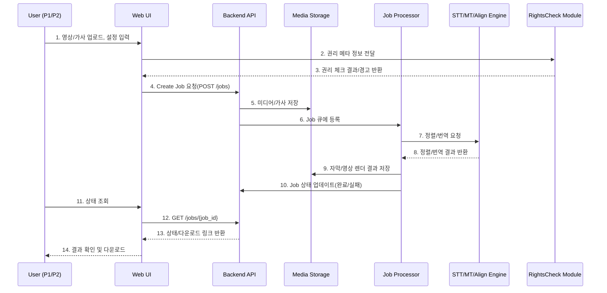
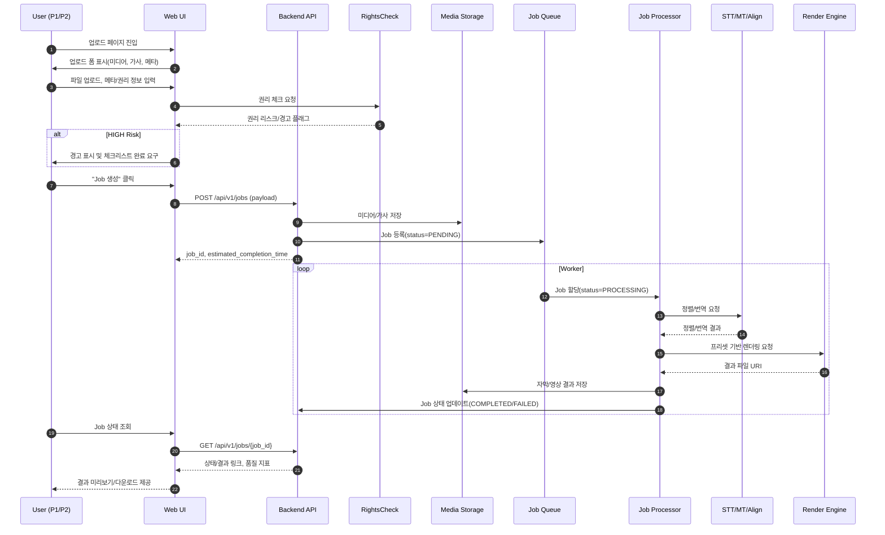
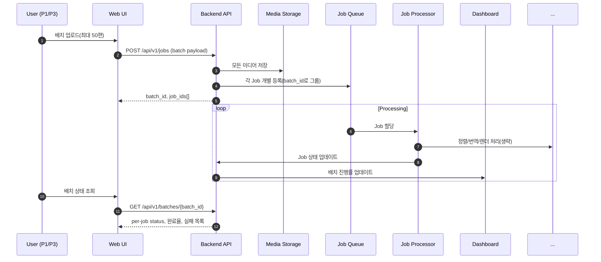

# Software Requirements Specification (SRS)
Document ID: SRS-001
Revision: 1.0
Date: 2025-11-14
Standard: ISO/IEC/IEEE 29148:2018

-------------------------------------------------

## 1. Introduction

### 1.1 Purpose

본 문서는 다국어 노래방 자막 영상 SaaS(이하 “시스템”)에 대한 **Software Requirements Specification(SRS)**를 정의한다.
본 SRS는 `Product Requirements Document.md`(이하 PRD)를 **유일한 비즈니스/기능 요구의 출처(Source of Truth)**로 삼아, ISO/IEC/IEEE 29148:2018 표준에 따라 **완전하고, 테스트 가능하며, 추적 가능한** 요구사항을 기술한다.

해당 시스템의 목적은 다음과 같다.

- 유튜브 카라오케 채널 운영자(P1), 음악 교육자(P2) 등을 위해
  - 오디오/영상과 가사를 입력으로 받아
  - 음절/박자 단위 정밀 싱크와 다국어 번역을 수행하고
  - 플랫폼(YouTube/TikTok/Shorts)에 적합한 카라오케 싱얼롱 영상을 자동 생성·배포하며
  - 업로드 단계에서 권리·저작권 리스크를 사전 진단/경고하고
  - 배치 처리 및 API 통합을 통해 대량·반복 작업의 생산성과 안정성을 보장하는 것.

본 문서는 개발, 테스트, 운영, 법무/컴플라이언스, 이해관계자 간 공통 참조 기준으로 사용된다.

### 1.2 Scope (In-Scope / Out-of-Scope)

#### In-Scope

- **배치형 다국어 노래방 자막 영상 생성**
  - 입력: 녹화된 오디오/영상 파일(최대 길이 10분), 가사 텍스트, 메타데이터(언어, 곡 정보 등)
  - 출력: 목적지 플랫폼(YouTube/TikTok/Shorts)용 카라오케 스타일 싱얼롱 동영상 파일 및 자막 파일(SRT/ASS 등)
- **음절/박자 단위 정밀 싱크 엔진**
  - 오디오/영상과 가사 텍스트를 기반으로 음절·박자 레벨 타임코드 생성
- **멀티랭 자막 및 이중자막 지원**
  - 원어 + 번역 자막 생성 및 교육용 이중자막 템플릿 제공
- **업로드 단계 권리 체크(Pre-flight)**
  - 곡 메타정보·권리 보유 여부 입력 기반 권리 리스크 평가 및 경고
- **플랫폼 프리셋(YouTube/TikTok/Shorts)**
  - 코덱/해상도/비트레이트/자막 스타일 등 목적지별 프리셋
- **배치 처리 및 작업 대시보드**
  - 1회 최대 50편까지 배치 등록, 상태 모니터링, 재시도
- **웹 기반 워크플로 UI**
  - 업로드 → 설정 → 권리 체크 → 생성 → 검수(간단 편집) → 결과 다운로드/게시 흐름
- **제한적 API 제공**
  - 작업 생성/조회 및 메트릭 조회용 REST API

#### Out-of-Scope

- 라이브 스트리밍/실시간 싱얼롱 자막 생성
- 온프레미스 전용 배포 패키지 및 완전 커스텀 인프라 구성
- 저작권 라이선스 계약 체결/로열티 정산 기능(법무/회계 시스템)
- 풀 스튜디오급 영상 편집(컷 편집, 색보정, 합성 등)
- 완전 자동 저작권 면책 보장(본 시스템은 리스크 완화 도구이며, 법적 책임을 대체하지 않음)

### 1.3 Definitions, Acronyms, Abbreviations

- **P1**: YouTube 카라오케 채널 운영자(Core Persona)
- **P2**: 음악 교육자/학원·학교(Core Persona)
- **P3**: 레이블/로컬라이제이션 담당자(Adjacent Persona)
- **P4**: 노래방/업장 운영자(Adjacent Persona)
- **JTBD (Jobs-To-Be-Done)**: 사용자가 시스템을 통해 달성하려는 근본적 “진행(Progress)” 혹은 일(Job)
- **Story**: PRD에서 정의된 사용자 스토리 (Story 1, Story 2, Story 3)
- **AOS (Adjusted Opportunity Score)**: Importance × (1 − Satisfaction/5)
- **DOS (Discovered Opportunity Score)**: (Importance − Satisfaction) × Market Relevance
- **TAT (Turnaround Time)**: 작업 시작부터 완료까지의 총 소요 시간
- **p95**: 측정 지표의 95th percentile 값
- **SLA (Service Level Agreement)**: 합의된 서비스 수준 지표(가용성 등)
- **API**: Application Programming Interface
- **UI**: User Interface
- **QoS**: Quality of Service
- **REQ-FUNC-xxx**: Functional Requirement ID
- **REQ-NF-xxx**: Non-Functional Requirement ID
- **TC-xxx**: Test Case ID
- **NS KPI (North Star KPI)**: 제품의 핵심 성공 지표
- **Batch**: 여러 개의 영상 작업(Job)을 묶어 처리하는 단위

### 1.4 References (REF-XX)

- **REF-01**: PRD — “다국어 노래방 자막 영상 SaaS — PRD v0.1”, 2025-11-14
- **REF-02**: Value Position Sheet — `plan/Value Position Sheet.md`
- **REF-03**: Porter’s Five Forces 분석 — `analysis/1_Porters_Five_Forces_Analysis_Multilingual_Karaoke_Subtitle_Video_SaaS.md`
- **REF-04**: Value Chain 분석 — `analysis/2_Value_Chain_Analysis_Multilingual_Karaoke_Subtitle_Video_SaaS.md`
- **REF-05**: Top 5 KSFs — `analysis/3_Top_5_KSFs_New_Entrant_Multilingual_Karaoke_Subtitle_Video_SaaS.md`
- **REF-06**: TAM/SAM/SOM & Segment Map — `analysis/5_TAM-SAM-SOM_and_Segment_Map_Multilingual_Karaoke_Subtitle_Video_SaaS.md`
- **REF-07**: Persona Spectrum & CJM — `analysis/6_Persona_Spectrum_and_CJM_Multilingual_Karaoke_Subtitle_Video_SaaS.md`
- **REF-08**: Problem Definition — `analysis/4_Problem_Definition_Multilingual_Karaoke_Subtitle_Video_SaaS.md`
- **REF-09**: AOS-DOS Matrix — `analysis/7_AOS-DOS_Matrix_and_Opportunity_Assessment_Multilingual_Karaoke_Subtitle_Video_SaaS.md`
- **REF-10**: JTBD Interview Plan — `analysis/8_JTBD_Interview_Plan_and_Report_Multilingual_Karaoke_Subtitle_Video_SaaS.md`

---

## 2. Stakeholders

| Role ID | 역할(Role) | 책임(Responsibility) | 관심사(Interest) |
| --- | --- | --- | --- |
| STKH-01 | P1: 유튜브 카라오케 채널 운영자 | 싱얼롱 영상 기획, 제작, 업로드, 채널 성장 | 제작 리드타임 단축, 마감 내 게시, 스트라이크 최소화, 시청 유지율/수익 극대화 |
| STKH-02 | P2: 음악 교육자/학원·학교 | 수업·과제용 싱얼롱 콘텐츠 제작·운영 | 이중자막·정밀 싱크, 학생 참여율·학습 효율 향상, 제작 시간 단축 |
| STKH-03 | P3: 레이블/로컬라이제이션 담당자 | 카탈로그 다국어 패키지 생성, 권리 준수, 플랫폼 배포 | 권리/컴플라이언스, API/배치, 감사로그, SLA |
| STKH-04 | P4: 노래방/업장 운영자 | 매장용 영상 패키지 구성 및 재생 관리 | 안정적 재생, SLA, 오프라인 패키지 품질 |
| STKH-05 | 시스템 관리자/DevOps | 시스템 인프라, 배포, 모니터링 관리 | 가용성, 성능, 비용 최적화, 장애 대응성 |
| STKH-06 | 법무/컴플라이언스 담당자 | 저작권/라이선스 리스크 관리 | 경고·스트라이크 감소, 정책 준수 가시성 |
| STKH-07 | 제품/데이터 분석가 | KPI 측정·분석, 제품 개선 인사이트 도출 | NS KPI 및 보조 KPI, A/B 테스트 결과, 품질/리스크 지표 |
| STKH-08 | 외부 플랫폼(YouTube/TikTok 등) | 업로드 콘텐츠의 규격·정책 준수 검사 | 기술 규격(코덱/자막 규칙) 및 저작권 정책 준수 |

---

## 3. System Context and Interfaces

### 3.1 External Systems

- **EXT-01: 동영상 호스팅/플랫폼**
  - YouTube, TikTok, Shorts 등
  - 역할: 결과 영상 업로드·게시, 자동 자막/저작권 탐지, 규격 검증
- **EXT-02: STT/MT/정렬 엔진**
  - 음성 인식, 번역, 정렬(ASR, MT, alignment) 서비스 (자체/외부)
  - 역할: 가사 정렬, 번역, 언어 감지
- **EXT-03: 클라우드 스토리지/미디어 서비스**
  - 예: S3/GCS 등
  - 역할: 업로드된 미디어/중간 결과/최종 결과 파일 저장
- **EXT-04: 가사/곡 메타데이터 DB**
  - 라이선스된 가사 DB 또는 내부 메타 저장소
  - 역할: 곡 정보 조회, 권리 체크 보조
- **EXT-05: 고객 시스템(API 클라이언트)**
  - 채널 관리 도구, 내부 CMS 등
  - 역할: API를 통해 Job 생성/조회, 메트릭 조회

### 3.2 Client Applications

- **WEB-UI**
  - 브라우저 기반 사용자 인터페이스
  - 주요 기능: 업로드, 설정, 권리 체크, 배치 생성/모니터링, 결과 검수·다운로드
- **API Client**
  - 스크립트, 서버 애플리케이션, 노코드 툴 등
  - 사용 목적: 대량 자동화, 기존 워크플로와의 통합

### 3.3 API Overview

주요 API 엔드포인트(상세는 Appendix 6.1 참조):

- `POST /api/v1/jobs`
  - 목적: 영상/가사/설정을 기반으로 Job(단일 또는 배치) 생성
- `GET /api/v1/jobs/{job_id}`
  - 목적: Job 상태 및 결과 조회
- `GET /api/v1/metrics/jobs`
  - 목적: 기간/채널/프리셋 기준 Job 성능 및 품질 지표 조회

### 3.4 Interaction Sequences (핵심 시퀀스 다이어그램)

#### 3.4.1 단일 Job 생성 및 처리 시퀀스 (Story 1 기준)

#### 3.4.2 배치 Job 처리 및 모니터링(요약)

- 단일 Job 처리와 동일하나, `POST /jobs` 요청 시 여러 미디어 항목 및 배치 ID가 포함되며, Processor는 병렬/큐 기반으로 개별 Job을 처리하고, 대시보드는 배치별 진행률을 표시한다(자세한 버전은 Appendix 6.3 참조).

---

## 4. Specific Requirements

### 4.1 Functional Requirements

> 규칙:
> - ID 형식: REQ-FUNC-xxx
> - Priority: M/S/C/W (PRD MSCW 맵핑)
> - Source: Story 1/2/3, PRD Section 4
> - AC는 Given/When/Then 형식. 성능 수치는 관련 NFR(REQ-NF-xxx) 참조.

#### 4.1.1 Functional Requirements Table

| ID | Name | Description (Functional Requirement) | Priority | Source | Acceptance Criteria (요약, G/W/T) |
| --- | --- | --- | --- | --- | --- |
| REQ-FUNC-001 | Job 생성(단일/배치) | 시스템은 사용자가 Web UI 또는 API를 통해 하나 이상의 미디어 항목(최대 50편)을 포함하는 Job을 생성할 수 있도록 해야 한다. | M | Story 1, PRD 4.1 M5/M6 | **G:** 유효한 미디어/가사/설정이 제공됨. **W:** 사용자가 “생성”을 요청. **T:** Job ID가 반환되고, 상태가 `PENDING` 또는 `QUEUED`로 저장되며 입력 유효성 검사가 실패한 항목은 명시적 오류 목록으로 반환된다. |
| REQ-FUNC-002 | 미디어 업로드 및 저장 | 시스템은 업로드된 오디오/영상·가사 파일을 내장 스토리지 또는 외부 스토리지에 저장하고, `MediaAsset` 엔터티로 관리해야 한다. | M | Story 1, PRD 4.1 M1/M6 | **G:** 사용자가 허용된 포맷의 파일을 업로드. **W:** 업로드 완료 이벤트 발생. **T:** 해당 파일이 스토리지 URI와 함께 `MediaAsset`에 기록되고, 허용되지 않은 포맷은 거부되어야 한다. |
| REQ-FUNC-003 | 권리 체크리스트 수행 | 시스템은 Job 생성 시 권리 메타데이터(곡 제목, 아티스트, 권리 보유 여부 등)를 입력받고, 룰셋 및 가사 DB를 기반으로 권리 리스크 레벨을 산출해야 한다. | M | Story 2, PRD 4.1 M3 | **G:** 곡 정보와 권리 보유 여부가 입력됨. **W:** Job 생성 시 권리 체크 모듈 실행. **T:** 각 Job에 대해 `RightsCheck` 레코드가 생성되고, 리스크 레벨이 `LOW/MED/HIGH` 중 하나로 설정되며, HIGH인 경우 UI에 경고가 표시된다. |
| REQ-FUNC-004 | 권리 체크 강제 흐름 제어 | 시스템은 권리 체크리스트가 100% 완료되기 전에는 최종 렌더/게시 프리셋 적용 단계를 진행할 수 없도록 해야 한다. | M | Story 2, PRD 4.1 M3 | **G:** 권리 체크리스트에 미완료 항목이 존재. **W:** 사용자가 렌더/게시 버튼 클릭. **T:** 시스템은 작업을 차단하고, 미완료 항목을 명시하는 오류 메시지를 표시해야 한다. |
| REQ-FUNC-005 | 카라오케 정렬(음절/박자) 실행 | 시스템은 Job 처리 시 오디오/영상과 가사 텍스트를 입력으로 STT/정렬 엔진을 호출하여, 각 가사 라인·음절에 대한 타임코드를 생성해야 한다. | M | Story 1, PRD 4.1 M1 | **G:** Job이 `PROCESSING` 상태로 전환. **W:** 정렬 단계 실행. **T:** 각 가사 라인에 최소 시작·종료 타임코드가 생성되고, 실패 시 Job은 `FAILED` 상태와 오류 코드(정렬 실패)를 가져야 한다. |
| REQ-FUNC-006 | QoS 기반 싱크 품질 계산 | 시스템은 생성된 타임코드를 기반으로 싱크 정확도(QoS)를 계산하고, Job 단위 품질 지표를 저장해야 한다. | M | Story 1, PRD 4.1 M1 | **G:** 정렬 결과가 존재. **W:** QoS 계산 모듈 실행. **T:** `MetricSnapshot`에 sync_accuracy(±150ms, ±200ms 구간 비율 등)이 기록되고, UI/대시보드에서 조회 가능해야 한다. |
| REQ-FUNC-007 | 멀티랭 자막 및 번역 처리 | 시스템은 지정된 대상 언어 목록에 대해 원어 가사를 번역(자동/수동 입력 포함)하고, 언어별 `SubtitleTrack`을 생성해야 한다. | M | Story 1,3, PRD 4.1 M2 | **G:** Job에 target_languages가 설정. **W:** 번역 단계 실행. **T:** 각 대상 언어에 대해 최소 1개의 `SubtitleTrack` 레코드가 생성되고, 번역 실패 시 해당 언어는 실패 상태로 기록되어야 한다. |
| REQ-FUNC-008 | 이중자막 템플릿 적용 | 시스템은 선택된 교육용 이중자막 템플릿을 원어 + 번역 자막에 적용하여, 레이아웃·색상·폰트 설정이 반영된 자막/영상 결과를 생성해야 한다. | M | Story 3, PRD 4.1 M2 | **G:** 교육자가 이중자막 템플릿 선택. **W:** 렌더링 호출. **T:** 결과 영상/자막에서 두 언어 트랙이 템플릿 규칙에 따라 동시에 표시되고, 텍스트 클리핑 여부를 검증해야 한다(관련 NFR 참조). |
| REQ-FUNC-009 | 플랫폼 프리셋 설정 및 렌더링 | 시스템은 YouTube/TikTok/Shorts 프리셋을 제공하고, 선택된 프리셋에 따라 인코딩 파라미터(코덱/해상도/비트레이트/자막 스타일)를 설정하여 최종 영상을 렌더링해야 한다. | M | Story 1,2, PRD 4.1 M4 | **G:** 사용자가 플랫폼 프리셋 선택. **W:** 렌더링 요청. **T:** 결과 파일 메타데이터가 프리셋 규격과 일치해야 하며, 업로드 실패율 관련 NFR을 충족해야 한다. |
| REQ-FUNC-010 | 배치 처리 및 상태 모니터링 | 시스템은 배치 ID를 기반으로 여러 Job의 상태(대기/처리 중/완료/실패)를 집계·표시하고, 배치 진행률을 제공해야 한다. | M | Story 1, PRD 4.1 M5 | **G:** 배치에 1개 이상 Job이 포함. **W:** 대시보드 또는 API에서 배치 조회. **T:** 각 Job의 최신 상태가 표시되고, 배치 완료율(%)이 계산되어야 한다. |
| REQ-FUNC-011 | Job 재시도 및 오류 관리 | 시스템은 실패한 Job에 대해 재시도 기능을 제공하고, 재시도 시 원인 코드별 정책(자동 재시도/수동 재시도)을 적용해야 한다. | S | PRD 4.1 M5, 5(NFR) | **G:** Job 상태가 FAILED. **W:** 사용자가 재시도 요청 또는 자동 재시도 조건 충족. **T:** Job이 새로운 시도 기록과 함께 재처리되며, 재시도 횟수 제한 및 최종 실패 상태가 기록되어야 한다. |
| REQ-FUNC-012 | 간단 편집기(싱크 시프트/텍스트 수정) | 시스템은 UI에서 라인 단위 싱크 시프트(타임라인 드래그/슬라이더) 및 텍스트 수정 기능을 제공해야 한다. | S | Story 1,3, PRD 4.1 S1 | **G:** Job이 완료 상태이고 편집 화면 진입. **W:** 사용자가 특정 라인을 선택해 타이밍 이동 또는 텍스트 수정. **T:** 수정 내용이 미리보기와 저장된 `SubtitleTrack`에 반영되고, 변경 이력 또는 버전이 기록되어야 한다. |
| REQ-FUNC-013 | Job 생성/조회 API 제공 | 시스템은 REST API를 통해 Job 생성(단일/배치) 및 상태 조회를 지원해야 한다. | S | Story 1, PRD 4.1 S2, 6.데이터/인터페이스 | **G:** 유효한 인증 토큰 및 요청 페이로드. **W:** 클라이언트가 `POST /api/v1/jobs` 또는 `GET /api/v1/jobs/{job_id}` 호출. **T:** 요청이 유효하면 Job이 생성/조회되고, 유효하지 않으면 적절한 오류 코드와 메시지를 반환해야 한다. |
| REQ-FUNC-014 | 메트릭/리포트 조회 API 제공 | 시스템은 Job 성능 및 품질(예: TAT 분포, 성공률, 싱크 정확도)을 조회하는 메트릭 API를 제공해야 한다. | S | PRD 4.1 S3, 5(NFR) | **G:** 권한이 있는 사용자/클라이언트. **W:** `GET /api/v1/metrics/jobs` 호출. **T:** 기간 및 필터에 해당하는 집계 결과가 반환되어야 한다. |
| REQ-FUNC-015 | 권리 리스크 대시보드 | 시스템은 채널/코호트별 저작권 경고/스트라이크 건수 및 권리 체크 커버리지를 시각화해야 한다. | S | Story 2, PRD 4.1 S3, 5 | **G:** 적절한 권한을 가진 사용자. **W:** 리스크 대시보드 화면 조회. **T:** 사용 기간 내 스트라이크/경고/커버리지 지표가 표시되고, 필터(기간, 채널)가 동작해야 한다. |
| REQ-FUNC-016 | 사용자 및 권한 관리(요약) | 시스템은 최소한 채널 단위의 사용자 계정과 권한(관리자/편집자)을 구분하여 Job/메트릭 접근을 제어해야 한다. | M | PRD 5(NFR 보안 전제) | **G:** 관리자가 사용자 계정 생성/역할 부여. **W:** 사용자가 로그인 및 리소스 접근 시도. **T:** 사용자는 자신의 채널 범위 내 Job/메트릭만 접근 가능해야 한다. |

(필요 시 후속 이터레이션에서 추가 REQ-FUNC 확장 가능)

---

### 4.2 Non-Functional Requirements (NFR)

> 규칙:
> - ID 형식: REQ-NF-xxx
> - KPI/성능/가용성/보안/모니터링/Scalability/Maintainability를 포함
> - 모든 수치는 테스트 가능해야 함.

#### 4.2.1 Non-Functional Requirements Table

| ID | Category | Description | Metric / Target | Related Story / PRD |
| --- | --- | --- | --- | --- |
| REQ-NF-001 | Performance (TAT) | 5분 이하 영상 기준, 자동 카라오케 자막 생성 엔드투엔드 TAT는 p95 기준 10분 이하여야 한다. | p95 TAT ≤ 10분 (5분 이하 영상, 정상 케이스의 ≥95%) | Story 1, PRD 1·5 |
| REQ-NF-002 | Performance (UI) | Web UI 주요 화면(대시보드, Job 상세) 로드 시간은 p95 기준 2초 이하여야 한다. | p95 UI 응답 시간 ≤ 2초 | PRD 5 |
| REQ-NF-003 | Performance (API) | Job 생성 API 응답 시간은 p95 기준 1초 이하여야 한다(큐잉 포함하지 않고, 요청 수락까지). | p95 API 응답 시간 ≤ 1초 | PRD 5 |
| REQ-NF-004 | Reliability (Availability) | 웹 및 API 서비스 월 가용성은 99.5% 이상이어야 한다. | 월 가용성 ≥ 99.5% | PRD 5 |
| REQ-NF-005 | Reliability (Job 실패율) | 시스템 오류로 인한 Job 실패율은 3% 이하여야 하며, 자동 재시도 후 최종 실패율은 1% 이하여야 한다. | 1차 실패율 ≤ 3%, 최종 실패율 ≤ 1% | PRD 5, 4.1 |
| REQ-NF-006 | Risk (저작권/스트라이크) | 권리 체크 기능을 사용하는 채널 코호트의 저작권 경고·스트라이크 발생률은 90일 기준로 비사용 코호트 대비 50% 이상 감소해야 하며, 절대 값은 0.1건/100영상 이하여야 한다. | 상대 감소 ≥ 50%, 스트라이크 ≤ 0.1/100영상 | Story 2, PRD 1·8 |
| REQ-NF-007 | Quality (싱크 정확도) | 싱얼롱 자막의 싱크 정확도는 전체 가사 라인 중 90% 이상이 ±150ms 이내, 95% 이상이 ±200ms 이내여야 한다. | ≥90% (±150ms), ≥95% (±200ms) | Story 1,3, PRD 1·5 |
| REQ-NF-008 | Quality (이중자막 가독성) | 교육용 이중자막 템플릿을 적용한 영상에서, 프레임의 95% 이상은 내부 가독성 규칙(대비비 ≥ 4.5:1, 최소 폰트 크기 ≥ 24pt)을 만족해야 한다. 텍스트 클리핑이 발생하는 프레임은 1% 이하여야 한다. | 가독성 양호 프레임 ≥ 95%, 클리핑 프레임 ≤ 1% | Story 3, PRD 5 |
| REQ-NF-009 | Usability (교육자 만족도) | 교육자 대상 설문에서 싱크 정확도 만족도가 평균 4.0/5.0 이상, 번역 자연스러움 만족도가 평균 3.8/5.0 이상이어야 한다. | 싱크 ≥ 4.0, 번역 ≥ 3.8 (5점 척도) | Story 3, PRD 8 |
| REQ-NF-010 | Productivity (제작 시간 단축) | 베타 사용자 기준, 영상 1편당 평균 제작 리드타임은 기존 대비 80% 이상 감소해야 하며, 목표 값은 10분 이하/편이다. | 리드타임 ≥ 80% 감소, 평균 ≤ 10분/편 | Story 1,3, PRD 1·8 |
| REQ-NF-011 | Scalability (Batch 처리) | 한 배치당 최대 50편 영상 처리 시, 90% 이상의 Job이 2시간 이내에 완료되어야 한다. | 배치 내 Job 90% 완료 ≤ 2시간 | Story 1, PRD 1·5 |
| REQ-NF-012 | Security (Access Control) | 채널 단위 데이터 격리가 보장되어야 하며, 사용자는 자신의 채널에 속한 Job/메트릭에만 접근할 수 있어야 한다. | 교차 채널 데이터 접근 0건(테스트 및 감사 로그 기준) | PRD 5 |
| REQ-NF-013 | Security (Data Retention) | 업로드된 음원/영상 파일은 작업 완료 후 30일 이내 자동 삭제되어야 한다(정책에 따라 설정 가능). | 30일 이후 보관 파일 0건(예외 정책 제외) | PRD 5 |
| REQ-NF-014 | Observability (모니터링) | 시스템은 Job TAT 분포, 실패율, 싱크 정확도, 권리 체크 커버리지, 스트라이크/경고 건수, GPU 사용률 등을 대시보드와 로그로 노출해야 한다. | 주요 지표에 대해 실시간 또는 ≤5분 지연으로 조회 가능 | PRD 5·8 |
| REQ-NF-015 | Cost Efficiency | 기준 워크플로(프리랜서/스튜디오 외주) 대비 단위 영상당 총 비용이 50% 이상 절감되도록 가격/인프라 모델을 설계해야 한다. | 단위 비용 ≥ 50% 절감(비교 실험 기준) | PRD 8 |
| REQ-NF-016 | Maintainability | 주요 서비스는 컨테이너 기반 배포 및 헬스 체크를 지원해야 하며, 장애 발생 시 평균 복구 시간(MTTR)은 1시간 이하를 목표로 한다. | MTTR ≤ 1시간 (운영 리포트 기준) | PRD 5 |
| REQ-NF-017 | Compatibility (플랫폼 프리셋) | 프리셋을 사용해 생성한 영상의 플랫폼 규격 불일치로 인한 업로드 실패율은 전체 업로드의 1% 이하여야 한다. | 업로드 실패(규격 이슈) ≤ 1% | Story 2, PRD 3·5 |

---

## 5. Traceability Matrix

Story, Requirement, Test Case 간 추적성 매트릭스는 다음과 같다.

| Story ID | Story Summary | Requirement IDs (FUNC & NF) | Test Case IDs (예시) |
| --- | --- | --- | --- |
| Story 1 | “10분 이내 자동 싱얼롱 영상 생성” | REQ-FUNC-001, 002, 005, 006, 007, 009, 010, 012, 013, 014, REQ-NF-001, 002, 003, 004, 005, 007, 010, 011 | TC-001 ~ TC-020 |
| Story 2 | “업로드 단계에서 저작권·스트라이크 리스크 최소화” | REQ-FUNC-003, 004, 009, 015, 016, REQ-NF-004, 006, 012, 013, 014, 017 | TC-021 ~ TC-035 |
| Story 3 | “이중자막·고가독성 교육용 싱얼롱 영상” | REQ-FUNC-007, 008, 012, REQ-NF-007, 008, 009, 010 | TC-036 ~ TC-045 |

> 각 TC는 별도의 테스트 명세서에서 상세 Given/When/Then과 테스트 데이터, 기대 결과를 정의하며, 여기서는 ID 레벨 매핑만 제공한다.

---

## 6. Appendix

### 6.1 API Endpoint List

| No | Method | Endpoint | Description | Request (요약) | Response (요약) | Related Requirements |
| --- | --- | --- | --- | --- | --- | --- |
| API-01 | POST | `/api/v1/jobs` | 단일/배치 Job 생성 | media_assets[], preset_id, target_languages[], platform, rights_metadata | job_id, batch_id, estimated_completion_time, invalid_items[] | REQ-FUNC-001, 002, 003, 013, REQ-NF-003 |
| API-02 | GET | `/api/v1/jobs/{job_id}` | Job 상태 및 결과 조회 | path: job_id, auth token | status, progress, result_links, error_details | REQ-FUNC-010, 013, REQ-NF-002 |
| API-03 | GET | `/api/v1/metrics/jobs` | Job/배치 메트릭 조회 | query: from, to, channel_id, preset, platform | aggregated TAT, success/fail rates, sync_accuracy, rights_coverage | REQ-FUNC-014, 015, REQ-NF-001, 004, 005, 006, 007, 014 |
| API-04 | POST/PUT | `/api/v1/jobs/{job_id}/retry` (예시) | 실패 Job 재시도 | path: job_id | new_attempt_id, status | REQ-FUNC-011, REQ-NF-005 |
| API-05 | GET | `/api/v1/batches/{batch_id}` | 배치 상태 조회 | path: batch_id | batch progress, per-job status | REQ-FUNC-010, REQ-NF-011 |

### 6.2 Entity & Data Model

#### 6.2.1 Entity: Project/Job

| Field | Type | Description | Constraints |
| --- | --- | --- | --- |
| id | UUID | Job 식별자 | Primary Key |
| owner_id | UUID | 채널/계정 소유자 ID | Not null, FK(User/Channel) |
| batch_id | UUID (nullable) | 배치 ID | FK(Batch) |
| status | ENUM (`PENDING`, `QUEUED`, `PROCESSING`, `COMPLETED`, `FAILED`) | Job 상태 | Not null |
| preset_id | UUID | 사용된 프리셋 ID | Not null |
| target_platform | ENUM (`YOUTUBE`, `TIKTOK`, `SHORTS`, etc.) | 목적지 플랫폼 | Not null |
| target_languages | Array<String> | 대상 자막 언어 목록 | Not null |
| created_at | Timestamp | 생성 시각 | Not null |
| completed_at | Timestamp (nullable) | 완료 시각 | status=COMPLETED일 때 필수 |
| error_code | String (nullable) | 실패 사유 코드 | status=FAILED일 때 필수 |

#### 6.2.2 Entity: MediaAsset

| Field | Type | Description | Constraints |
| --- | --- | --- | --- |
| id | UUID | Asset ID | Primary Key |
| job_id | UUID | 관련 Job ID | FK(Job) |
| type | ENUM (`AUDIO`, `VIDEO`, `LYRICS`) | 미디어 종류 | Not null |
| storage_uri | String | 스토리지 경로 | Not null |
| duration | Integer (ms) | 길이 | AUDIO/VIDEO 필수 |
| language | String (ISO 코드) | 언어 | LYRICS 필수 |
| checksum | String | 무결성 체크값 | Optional |

#### 6.2.3 Entity: SubtitleTrack

| Field | Type | Description | Constraints |
| --- | --- | --- | --- |
| id | UUID | SubtitleTrack ID | Primary Key |
| job_id | UUID | Job ID | FK(Job) |
| language | String | 자막 언어 코드 | Not null |
| type | ENUM (`ORIGINAL`, `TRANSLATION`, `BILINGUAL`) | 트랙 유형 | Not null |
| format | ENUM (`SRT`, `ASS`, `CUSTOM`) | 포맷 | Not null |
| qos_score | Float | 싱크 품질 점수 (0~1 또는 %) | Optional |
| content_uri | String | 자막 파일 위치 | Not null |

#### 6.2.4 Entity: RightsCheck

| Field | Type | Description | Constraints |
| --- | --- | --- | --- |
| id | UUID | RightsCheck ID | Primary Key |
| job_id | UUID | Job ID | FK(Job) |
| title | String | 곡 제목 | Not null |
| artist | String | 아티스트 | Not null |
| rights_owned | Boolean | 권리 보유 여부(사용자 입력) | Not null |
| risk_level | ENUM (`LOW`, `MEDIUM`, `HIGH`) | 리스크 수준 | Not null |
| checklist_score | Integer (0~100) | 체크리스트 완료율 | Not null |
| warning_flags | Array<String> | 경고 플래그 리스트 | Optional |

#### 6.2.5 Entity: MetricSnapshot

| Field | Type | Description | Constraints |
| --- | --- | --- | --- |
| id | UUID | MetricSnapshot ID | Primary Key |
| timestamp | Timestamp | 측정 시각 | Not null |
| job_id | UUID (nullable) | Job ID | FK(Job) |
| batch_id | UUID (nullable) | Batch ID | FK(Batch) |
| sync_accuracy_150ms | Float | ±150ms 이내 비율 | 0.0~1.0 |
| sync_accuracy_200ms | Float | ±200ms 이내 비율 | 0.0~1.0 |
| tat_ms | Integer | Job TAT(ms) | >= 0 |
| error_code | String (nullable) | Job 오류 코드 | Optional |
| platform_upload_result | ENUM(`SUCCESS`,`FAILED`,`PENDING`) | 업로드 결과 | Optional |

### 6.3 Detailed Interaction Models

#### 6.3.1 단일 Job 생성 및 처리 (상세)

#### 6.3.2 배치 Job 처리 및 대시보드

---

이로써, PRD를 기반으로 한 ISO/IEC/IEEE 29148:2018 준수 SRS(Functional / Non-Functional / Interface / Data / Constraints 분리, 테스트 가능·추적 가능 구조, 시퀀스 다이어그램 및 Traceability Matrix 포함)를 완성하였다.